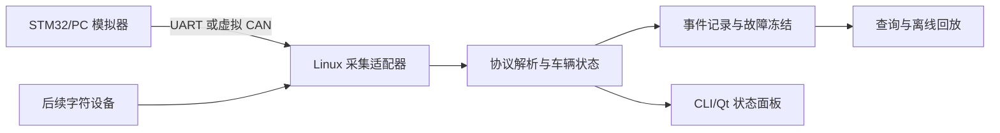

# 深圳嵌入式岗位截图分析与个人项目校准

分析日期：2026-08-17  
样本来源：用户提供的 37 张 BOSS 直聘岗位截图  
用途：判断第一段实习的现实入口，并据此选择个人项目

## 一、先给结论

1. **岗位要同时看，但以实习岗为主。** 后续继续按约 `70% 实习岗 + 30% 校招/0—3 年初级岗` 收集。实习岗决定近期投递门槛，初级正式岗用于确定未来一年技术上限。3 年以上岗位只作方向参考，不纳入近期差距清单。
2. **第一段实习最值得主攻的不是 PHYTEC、大疆或影石，而是深圳中小型智能硬件、机器人、摄像头和 Linux 设备团队。** 这些岗位与现有 Linux C、网络、串口、交叉编译和开发板经验衔接最好，也更认可个人项目。
3. **现阶段不用先系统学习 Buildroot/Yocto、复杂内核移植或硬件编解码。** 先把 C/C++、Linux 并发通信、外设数据链路、调试和项目完整性做好；驱动和媒体各加一个小而真实的扩展即可。
4. **最适合现在开工的个人项目是：`车载多传感器网关与故障记录系统`。** 它把原候选 1“STM32-Linux 通信实验台”和候选 4“黑匣子”合成一个主项目，后续再接候选 2 的简易字符驱动。这样一个项目可覆盖大多数样本岗位，又能直接迁移到 2027 年 4 月的 STM32 + RK3568 联合项目。

## 二、样本说明

37 张图片中包含同一岗位的连续页面和重复页面，合并后约有：

- 9 个与当前阶段直接相关的实习岗位；
- 3 个值得参考的校招、应届或 0—3 年初级岗位；
- 2 个要求 1—3 年或 3 年以上经验的社会招聘岗位；
- 2 个与技术方向无关的岗位（工业设计、HR），已排除。

因此不能把“37 张”当成 37 个独立岗位，也不能把截图出现次数直接当作市场统计。下面的频率仅用于识别这批目标岗位的共同门槛。

## 三、实习岗中反复出现的能力

| 能力 | 样本中的出现程度 | 现阶段判断 |
|---|---|---|
| C/C++、指针、内存、面向对象 | 几乎全部 | 必须作为主线，项目主体用 C++，底层模块可用 C |
| Linux/RTOS 基础 | 几乎全部 | 已有基础，下一步靠项目巩固，不重新纯学一遍 |
| 多线程、IPC、网络、进程模型 | 高频 | 现有网关经验可复用，但要升级为 C++ 工程并讲清线程边界 |
| UART/I2C/SPI/GPIO/USB/CAN、传感器 | 高频 | 先做 UART/虚拟 CAN，再逐步增加真实硬件 |
| 完整个人项目、竞赛或开源记录 | 高频 | 当前最需要补的不是知识点数量，而是一项完成度高的作品 |
| 调试、日志、文档、Git/CMake/GDB | 高频 | 采用轻量工程规范，逐步加强，不一开始堆流程 |
| 摄像头、视频或 ISP | 约半数目标岗位 | 是拓宽深圳机会面的有效加分项，但不必作为第一阶段核心 |
| 驱动/BSP、设备树、Bootloader | 部分专项岗及初级正式岗 | 第二阶段补一条真实驱动链路即可，暂不全面铺开 |
| Qt/UI | 少数岗位 | 是你已有的差异化能力，不应重新作为主方向 |
| Buildroot/Yocto、内核裁剪、性能追踪 | 正式岗更常见 | 作为未来一年目标，不是拿第一段实习的前置条件 |

### 这组岗位真正筛人的顺序

大致是：

`毕业年份/到岗时间/实习时长 → 是否有完整项目 → C/C++ 与 Linux 基础 → 并发通信和硬件接口 → 驱动/BSP/音视频专项加分`

这意味着，若到岗或年级不匹配，不应把被拒原因误判为技术不够；若硬条件匹配，一个能深入讲清楚的完整项目比再刷一轮零散知识点更有效。

## 四、截图岗位逐项判断

难度是“以当前经历取得面试或实习机会”的相对判断，不是公司好坏评价。

| 公司/岗位 | 类型与地点 | 主要要求 | 当前匹配 | 建议 |
|---|---|---|:---:|---|
| 深圳阿费卡科技，嵌入式实习 | 实习，深圳，20—99 人，可转正 | C/C++、并发、OS、Linux/RTOS、ARM/MCU、外设、GDB/CMake；个人项目可作为证明 | 高 | **第一梯队**。最值得核实业务、导师和实习时长 |
| 深圳妙动科技，摄像头/机器人软件实习 | 实习，深圳，可转正 | Linux、较强 C++、架构意识、从需求到落地的完整项目；约 6 个月 | 中高 | **第一梯队**。先用完整 C++ 项目补足说服力 |
| 公司信息被截图裁掉，Linux 开发实习 | 实习，可转正，地点待核实 | C/C++、交叉编译、CMake、多线程、IPC、网络、串口/I2C/SPI/USB/Ethernet，传感器/ISP 加分 | 高 | **第一梯队**。岗位本身与当前路线极贴合，优先找回公司和地点 |
| 深圳矽递科技（Seeed Studio），应用工程师实习 | 实习，深圳，27 届、6 个月，可转正 | 树莓派/Jetson/Arduino、C/Python/C++、英文、项目演示与文档、社区支持 | 中高 | **保底/桥梁岗**。较容易用项目和英文证明，但需确认编码占比，防止长期偏支持 |
| 深圳即行智能，车载嵌入式岗位 | 实习/校招倾向，深圳 | MCU、CAN/UART/SPI/I2C、VCU/仪表/BMS、PID、比赛、示波器/CANoe；985/211、26/27 届等硬筛 | 中低 | 条件式投递。硬筛和控制背景门槛高，不作为主押 |
| 影石，嵌入式实习 | 实习，深圳；截图显示 28 届优先、需较快到岗、6 个月；当时急招 UI | C/C++、OOP、多线程、设计模式、数据结构、英文；驱动/系统/通信/图像/音视频分方向 | 中 | 冲刺岗。Qt 能帮助切 UI，但时点和到岗要求可能直接决定资格 |
| 智驾嵌入式岗位（公司裁掉） | 实习，面向 28 届、稳定 6 个月 | C/C++、Linux/RTOS、算法数据结构、CAN/Ethernet、诊断、可靠性；AUTOSAR 加分 | 中 | 值得投，但先核实城市、年级与具体开发占比 |
| 魔视智能，嵌入式软件实习 | 实习，上海 | ARM Linux C++、线程/进程/文件、SPI/IPC、雷达摄像头、OTA、视频编解码、ADAS | 高 | 技术很贴合，但城市不符；可作为深圳同类岗位的 JD 模板 |
| 深眸远智，摄像头嵌入式实习 | 实习，苏州 | C、Linux、摄像头应用/驱动、启动速度、视频稳定性、功耗 | 中高 | 技术门槛相对友好，但城市不符；可用于寻找深圳同类公司 |
| 初级 Linux BSP/多媒体工程师（公司裁掉） | 0—3 年/优秀应届可考虑，地点待核实 | Bootloader、内核、设备树、驱动、Rockchip/Qualcomm、V4L2/DRM/ALSA/UVC/GStreamer/FFmpeg | 当前中低，未来高 | **非常有价值的 1 年目标画像**，不是要求现在全部掌握 |
| 2026 校招 Linux 全栈嵌入式岗位（公司裁掉） | 校招/正式 | Qt/Python、Buildroot/Yocto、内核配置、驱动移植、ftrace、硬件联调 | 中 | 用于校准长期能力；毕业届别不符时不纳入近期投递 |
| 大疆，Linux 底层岗位 | 正式，3 年以上 | Linux 框架/SDK/驱动、多种高速接口、SMP、启动、性能、功耗和系统架构 | 低 | 只作长期上限参考，不能拿来制定当前实习学习清单 |
| 北京信必优信息技术，Linux 驱动岗位（深圳） | 社招，1—3 年 | Linux/Android 嵌入式经验、C/C++、Linux 基础 | 低 | 要求已有工作经验，现阶段不主投；JD 信息也过少 |

## 五、第一段实习的投递优先级

### A 级：主投

- 深圳阿费卡科技这类：智能硬件/机器人 + Linux/RTOS + 外设/BSP；
- 深圳妙动这类：摄像头/机器人产品 + Linux C++；
- Linux 设备接入、传感器抽象、通信服务、边缘网关岗位；
- 车载 T-Box、仪表、Camera、座舱外围服务以及 STM32/Linux 联调岗位。

这些岗位最可能把你现有的 Linux 网关、RS485、开发板、Qt 和新个人项目连成一条叙事。

### B 级：保底与扩展

- Seeed 一类的应用开发/技术应用岗；
- 工业网关、物联网设备、开发板/芯片应用团队；
- 岗位名是“应用工程师”，但能持续写 C/C++、接触板卡和调试的岗位。

需要反向确认：每周写代码比例、是否有代码评审、能否接触 BSP/驱动、是否只是售前/客服/文档。

### C 级：冲刺

- 影石、大疆和头部智能驾驶公司；
- 对竞赛、名校、算法或特定届别有明显偏好的岗位。

可以投，但不能把半年准备时间全部围绕它们设计。

### 暂缓

- 明确要求 1—3 年以上正式工作经验的岗位；
- 纯 AUTOSAR、纯控制算法、纯图像算法岗位；
- 名为嵌入式但主要是手工测试、售后或文档录入的岗位。

## 六、据此收敛后的个人项目

### 项目名称

`VehicleEdgeGateway`：车载多传感器网关与故障记录系统

### 为什么它比单独做某个小 Demo 更合适

它同时覆盖这批实习岗最常见的能力：

- C/C++ 模块设计与内存安全；
- Linux 多线程、IPC、Socket、串口和后续 CAN；
- 传感器数据抽象、协议解析、超时与断线重连；
- 日志、配置、故障前后数据冻结与离线回放；
- CMake、Git、GDB、Sanitizer、单元测试和部署文档；
- 后续用字符设备补驱动，用摄像头补媒体，两者都能独立增加而不推翻主架构。

### 推荐开发顺序

#### 第 1 阶段：两周，先形成可运行闭环

- PC 模拟 STM32，每 100 ms 发送车速、转速、温度和心跳；
- Linux C++ 服务接收数据，处理半包、粘包、CRC 错误和超时；
- CLI 显示实时状态；
- 用 CMake 构建，保留清晰的 `src/include/tests/docs` 结构。

学习内容只在遇到时补：现代 C++ 资源管理、字节序、序列化、状态机、线程同步。

#### 第 2 阶段：两到三周，做成能讲完整的项目

- 采集、解析、存储分线程，使用有界队列；
- 循环日志和配置文件；
- 发生超温、丢心跳或模拟碰撞时，冻结故障前后数据；
- 离线回放并复现故障；
- 加入单元测试、AddressSanitizer/UndefinedBehaviorSanitizer 和故障注入。

#### 第 3 阶段：三到四周，接近真实嵌入式场景

- 把 TCP 模拟通道替换或扩展为 UART；
- 在 i.MX6ULL 上交叉编译、systemd 部署并连续运行；
- 增加重连、磁盘空间限制、优雅退出和运行统计；
- 有条件再引入 SocketCAN/vcan，而不是先买一堆硬件。

#### 第 4 阶段：二选一扩展

- **驱动/BSP 扩展：** 实现 `/dev/vehicle_sensor`，支持阻塞 `read`、`poll` 和简单 `ioctl`，再接入主服务；
- **音视频扩展：** 用 V4L2/GStreamer 接摄像头或视频文件，在故障发生时保存短片并和车辆数据按时间戳关联。

想优先拿通用 Linux/车载实习，先选驱动扩展；想明显提高影石/摄像头公司的匹配度，再选音视频扩展。

## 七、工程习惯的渐进要求

### 从第一天就做

- Git 小步提交，提交信息说明“为什么改”；
- CMake 一键构建，编译警告打开；
- 每个系统调用和外部输入都有错误处理；
- README 写清运行方法和架构图；
- 一个功能配一个可复现的验证方式。

### 项目跑通后再加

- `clang-format`；
- 核心协议与状态机单元测试；
- Sanitizer；
- 简单 CI；
- 版本号与变更记录。

### 暂时不强求

- 复杂分支模型；
- 很重的文档模板；
- 追求 100% 测试覆盖率；
- 一开始就引入 AUTOSAR、Yocto、大型框架或完整车规流程。

这比“模仿德国公司堆流程”更接近真正有价值的工程习惯：可读、可复现、可测试、可追踪。

## 八、请继续核实的字段

你后续找岗位时，每个岗位只需记录以下信息：

| 字段 | 为什么重要 |
|---|---|
| 公司、岗位链接、城市 | 防止截图裁掉后无法回查 |
| 实习/校招/社招 | 决定是否进入近期样本 |
| 面向毕业届别 | 最常见硬筛之一 |
| 最早到岗时间、每周天数、持续月数 | 可能比技术更早淘汰 |
| 日常编码比例 | 识别“开发岗”是否实为支持/测试 |
| 使用的 SoC、OS、语言、接口 | 判断项目是否真实匹配 |
| 是否有导师、代码评审、转正 | 判断实习质量 |
| 你满足/不满足/能用项目证明的要求 | 用于形成投递差距清单 |

建议下一批保持：**6—8 个真实实习岗 + 3—4 个应届/0—3 年岗位**。不需要大量收集高级社招，也不要只收藏大厂岗位。

## 九、当前最合理的行动

在没有更多硬条件冲突的前提下，先开始 `VehicleEdgeGateway` 第 1 阶段。你不需要等到所有前置知识学完；我可以先给出最小需求和架构边界，由你自己尝试设计协议与代码，我只在关键处提示、评审和补基础。

与此同时继续核实四类岗位：阿费卡、妙动、截图中公司被裁掉的 Linux 开发实习、Seeed。它们比 PHYTEC、大疆和影石更能代表第一段实习的现实门槛。
