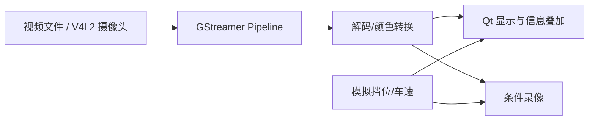
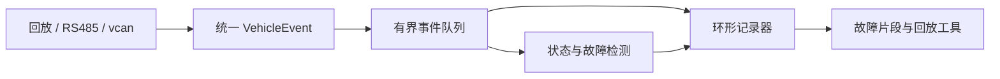
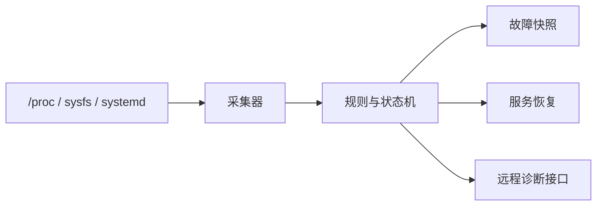
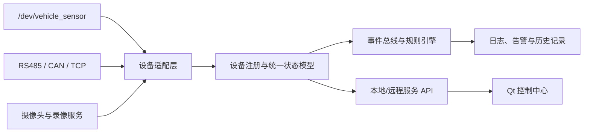

# Linux 嵌入式项目候选路线（从 Day55 开始）

更新日期：2026-08-17  
阶段终点：2027 年 4 月启动 STM32 + RK3568 联合项目  
长期方向：Linux 嵌入式驱动 / BSP、车载 Linux、Linux 音视频

> 2026-08-17 招聘截图校准：37 张截图合并后，近期目标岗位共同看重 C/C++、Linux、并发通信、外设联调和完整项目。当前推荐把候选 1 与候选 4 合成一个 `VehicleEdgeGateway` 主项目，跑通后再把候选 2 作为驱动扩展。完整依据见 [Job_Screenshot_Analysis_2026-08-17.md](./Job_Screenshot_Analysis_2026-08-17.md)。

> 当前顺序（2026-08-17）：先做候选 2 `VehicleSensorLab`，随后完成候选 3 智能倒车影像与事件记录；候选 6 智能网关放在最后，用来整合既有 Linux 应用、Qt、传感器驱动和音视频成果。项目入口见 [linux_projects/vehicle_sensor_lab/README.md](./linux_projects/vehicle_sensor_lab/README.md)。

## 一、这次先选项目，不提前锁死半年计划

你已经有 C/C++、Qt、Linux 系统编程、网络、交叉编译和 i.MX6ULL 上板经验。下一步采用项目驱动方式：

`先做最小闭环 → 遇到问题补基础 → 自己实现 → 测试调试 → 重构 → 再增加一层难度`

下面 6 个候选都满足：

- 一周内能看到运行结果；
- 不要求先连续学习几个月理论；
- 可以慢速迭代 2—3 个月；
- 能体现良好工程习惯；
- 对深圳嵌入式岗位或明年 STM32 + RK3568 项目有迁移价值。

选定一个后，再为它展开 Day55 之后的详细任务；其他项目不同时启动。

## 二、候选项目快速对比

评分 1—5，分数越高表示越贴合；“难度”越高表示需要跨越的知识层越多。

| 编号 | 项目 | 总体贴合 | 驱动/BSP | 车载项目 | 音视频 | 当前即可开始 | 难度 |
|---:|---|:---:|:---:|:---:|:---:|:---:|:---:|
| 1 | STM32-Linux 车载通信实验台 | 5 | 2 | 5 | 1 | 是，无需硬件 | 3 |
| 2 | Linux 虚拟车载传感器驱动栈 | 5 | 5 | 4 | 1 | 是，无需新硬件 | 4 |
| 3 | 智能倒车影像与行车记录原型 | 4.5 | 3 | 5 | 5 | 是，可先用视频文件 | 4 |
| 4 | 车载数据黑匣子与故障回放系统 | 4.5 | 2 | 5 | 1 | 是，可复用现有网关 | 3 |
| 5 | 嵌入式设备健康监控与现场诊断代理 | 4 | 3 | 3 | 2 | 是，可复用现有网关 | 3 |
| 6 | 智能嵌入式设备网关与 Qt 控制中心 | 5 | 3 | 4 | 3 | 是，但建议最后整合 | 4 |

选择建议：

- 想为明年联合项目做最直接准备：选 **1**。
- 想尽快从 Linux 应用进入驱动：选 **2**。
- 想兼顾 RK3568、智能座舱和大疆/影石方向：选 **3**。
- 想充分利用现有代码，先做出完成度最高的简历项目：选 **4**。
- 喜欢系统稳定性、调试和德国企业式工程化：选 **5**。
- 想把 Linux 应用、Qt、驱动和音视频统一成最终作品：最后做 **6**。

## 三、先拿第一段相关实习：企业进入难度判断

以下判断假设：本科及以上，能够连续实习约 6 个月，并且届时每周能到岗 4—5 天。学历、毕业年份和到岗时间是硬筛选项；不满足时，技术再匹配也可能无法进入流程。

### 相对进入难度

| 目标类型 | 机会密度 | 竞争/门槛 | 与当前能力匹配 | 第一段实习建议 |
|---|:---:|:---:|:---:|---|
| 深圳中小型车载电子、工业设备、智能硬件公司 | 高 | 中 | 高 | 第一投递梯队 |
| 通用嵌入式 Linux、机器人、芯片应用/FAE 开发团队 | 较高 | 中 | 高 | 第一投递梯队 |
| 乐鑫/M5Stack、OPPO、全志等平台或大中型公司 | 中 | 中高 | 中 | 第二投递梯队 |
| 影石 | 中 | 高 | 当前中等 | 冲刺梯队 |
| 大疆 | 中 | 很高 | 当前中等偏低 | 冲刺梯队 |
| PHYTEC 中国 | 低且不稳定 | 名额稀缺 | 长期匹配 | 机会型投递，不作为第一段实习主押 |

这里的“好进”是相对概率，不代表公司质量。中小型团队的优势是岗位更贴近具体产品、候选池通常小一些，也更可能接受“基础够用、项目完整、能长期到岗”的学生；风险是团队质量差异较大，面试时需要反向确认导师、代码评审、工作内容和是否只做测试/杂活。

### 对原目标的具体判断

#### PHYTEC

长期贴合度很高，但中国团队体量和开放岗位数量有限，官网也明确岗位不定期更新。它难在机会窗口，而不只是技术面试。因此可以保持联系和关注，但不应该把第一段实习的成功率押在这里。

#### Linux 车载嵌入式公司

这是当前最现实的入口。深圳车载模组、T-Box、智能座舱、车载 Camera 和零部件供应商数量更多，常见要求是 C/C++、Linux 调试、多线程、网络、交叉编译、UART/CAN 和软硬件联调。现有网关、i.MX6ULL、RS485、Qt 和后续个人项目都能直接转化为匹配项。

第一份实习不必限制在整车厂或头部 Tier 1。只要能真正参与 Linux C/C++、通信、驱动适配、板级调试或系统问题定位，就具有跳板价值。

#### 影石

相较大疆可以稍积极一些，但仍属于高竞争目标。当前公开的 2027 嵌入式岗位已经要求指针、内存布局、链接、Linux/RTOS、ARM、外设、BSP、Git/CMake/GDB 和英文文档能力，并把完整项目、驱动或板级经验列为加分项。完成候选 2 或 3 后再投会更有说服力。

#### 大疆

校招入口明确，但品牌竞争、笔试和基础要求都高。单个普通 Linux demo 很难形成区分度，需要扎实 C/C++、数据结构、系统基础，以及一个能深入追问性能、并发、驱动或媒体链路的项目。可以投，但第一段实习不能只押大疆。

### 值得作为第一段实习跳板的方向

- 车载模组/T-Box/智能座舱供应商；
- 摄像头、安防、行车记录仪和车载 Camera 公司；
- 工业网关、机器人、智能设备公司；
- Linux 应用与简单驱动混合岗位；
- 芯片应用、开发板、FAE 工具开发和系统验证岗位；
- STM32 + Linux 双平台联调岗位。

避开名为“嵌入式”但长期只做手工测试、文档录入、纯售后或完全接触不到代码的实习。

### 到投递期的建议比例

- 60%：中小型车载/工业/智能硬件 Linux 岗位；
- 25%：平台公司、芯片厂和质量较好的通用嵌入式团队；
- 10%：影石、大疆等高竞争目标；
- 5%：PHYTEC 及其他机会稀缺的长期目标。

### 如果以“先拿实习”为标准选择个人项目

推荐顺序调整为：

1. **候选 1：STM32-Linux 车载通信实验台**——岗位覆盖面最大，也直接服务明年项目；
2. **候选 4：车载数据黑匣子**——最容易基于现有代码做完整，面试时有稳定性与排障内容；
3. **候选 2：Linux 虚拟车载传感器驱动栈**——底层价值高，但第一版完成难度更大，适合第二个项目或作为候选 1 的后续驱动模块；
4. **候选 3：倒车影像原型**——适合明确喜欢音视频时选择；
5. **候选 5：健康监控代理**——工程性好，但第一份实习的岗位覆盖面略小。
6. **候选 6：智能网关**——综合价值高，但应在驱动和音视频项目之后实施，否则容易变成只有框架、缺少真实设备输入的大工程。

最稳的组合不是同时启动两个项目，而是：先完成候选 1 的通信闭环，再把候选 2 的 `/dev/vehicle_sensor` 作为新输入接进去。最终仍然是一个逐步深入的个人项目。

## 四、候选 1：STM32-Linux 车载通信实验台

建议名称：`McuLinuxVehicleBridge`

### 做出来是什么

PC 程序先模拟 STM32，持续发送车速、转速、挡位、温度和故障码；Linux 服务接收并解析数据，维护车辆状态，再通过 Qt 或 CLI 展示。以后把 PC 模拟器替换为真实 STM32，把 Linux 服务迁移到 RK3568。

```mermaid
flowchart LR
    A["STM32 模拟器\n后续替换为真机"] -->|"UART / TCP / CAN"] B["Linux 通信服务"]
    B --> C["协议解析与状态机"]
    C --> D["车辆状态模型"]
    D --> E["Qt/CLI 仪表"]
    D --> F["日志与故障记录"]
```

### 边做边学的前置知识

- 二进制协议、帧头、长度、序号、CRC；
- 大小端、结构体对齐和序列化；
- 状态机、超时、断线重连；
- UART/termios，后续再加入 SocketCAN；
- C/C++ 模块边界与 `extern "C"`；
- Qt 信号槽与后台通信线程。

### 第一周就能完成的结果

1. 定义一版最小协议，只包含车速、转速和心跳。
2. 写模拟器，每 100 ms 发送一帧。
3. Linux 服务能够找帧头、校验长度并输出解析结果。
4. 故意插入半包、粘包、错误 CRC，程序不崩溃。

### 后续可逐步增加

- UART、CAN 双通道；
- Qt 仪表盘；
- 心跳和通信故障状态；
- 参数配置、日志和数据回放；
- STM32 真机替换模拟器；
- RK3568 systemd 部署。

### 简历亮点

跨 MCU/Linux 通信、协议设计、异常恢复、C/C++、Qt、串口/CAN、软硬件联合调试。它与明年联合项目贴合度最高，但驱动深度需要后续追加。

## 五、候选 2：Linux 虚拟车载传感器驱动栈

建议名称：`VehicleSensorDriverStack`

### 做出来是什么

实现一个可以产生速度、温度或碰撞事件的 Linux 虚拟传感器驱动，用户态程序通过 `/dev/vehicle_sensor` 读取数据、等待事件并配置参数。稳定后迁移到 i.MX6ULL 的 GPIO、按键或真实 I2C 传感器。


### 边做边学的前置知识

- 用户态与内核态、系统调用；
- 内核模块构建、加载和日志；
- 字符设备、miscdevice、file_operations；
- `copy_to_user`/`copy_from_user`；
- 阻塞读取、wait queue、poll；
- platform bus、device tree、probe/remove；
- 内核同步和资源生命周期。

### 第一周就能完成的结果

1. 为当前开发板准备模块构建环境。
2. 编译、加载和卸载一个最小模块。
3. 注册 `/dev/vehicle_sensor`。
4. 用户态执行 `read`，获得驱动生成的一条模拟温度数据。

### 后续可逐步增加

- ioctl 设置采样周期；
- 阻塞 read 与 poll；
- 内核环形缓冲区；
- 多进程访问和异常卸载；
- platform driver 与设备树匹配；
- 真实 GPIO/I2C 输入；
- 接入候选 1 或 4 的用户态服务。

### 简历亮点

从设备树、驱动、UAPI 到用户态应用的完整链路，是从应用转驱动/BSP 最直接的项目。难度最高，初期界面效果不强，但底层含金量最好。

## 六、候选 3：智能倒车影像与行车记录原型

建议名称：`SmartRearViewPipeline`

### 做出来是什么

Linux 程序接收摄像头或视频文件，显示倒车影像，叠加挡位、速度和告警信息，同时按条件录像。前期在 Ubuntu/WSL 可访问的 Linux 环境使用视频文件，后续迁移到 RK3568、V4L2 摄像头和硬件编解码。



### 边做边学的前置知识

- container、codec、pixel format、帧率；
- GStreamer element、pad、pipeline、bus；
- PTS/DTS 和音视频/状态时间同步；
- V4L2 的职责和 buffer 基础；
- Qt 视频显示和线程边界；
- 文件轮转、性能与内存观察。

### 第一周就能完成的结果

1. 使用 `gst-launch` 播放测试源或本地视频。
2. 用 C/C++ 创建同样的最小 pipeline。
3. 正确处理启动、EOS、错误和退出。
4. 根据模拟挡位决定显示或隐藏视频窗口。

### 后续可逐步增加

- Qt 画面嵌入和车速/轨迹线叠加；
- USB 摄像头/V4L2；
- 循环录像和事件锁定片段；
- UDP/RTP 传输；
- RK3568 硬件编解码；
- 简单障碍物或车道提示演示。

### 简历亮点

车载座舱、Qt、V4L2、GStreamer、视频 pipeline、性能分析和 RK3568 迁移。展示效果最好，也最能连接车载与大疆/影石方向，但对纯 BSP 的帮助不如候选 2。

## 七、候选 4：车载数据黑匣子与故障回放系统

建议名称：`VehicleEventRecorder`

### 做出来是什么

接收回放文件、RS485、按键和后续 CAN 数据，维护车辆状态并循环记录。发生超温、碰撞或通信中断时，锁定故障前后的一段事件，支持远程查询和离线重放。



### 边做边学的前置知识

- 统一事件模型、序列化和字节序；
- 生产者消费者、有界队列；
- 环形缓冲区和状态机；
- 文件缓冲、`fsync`、轮转和磁盘满处理；
- 时间戳、排序和离线 replay；
- Sanitizer、Valgrind、GDB/core dump。

### 第一周就能完成的结果

1. 设计 `VehicleEvent`。
2. 从测试文件回放速度、温度和故障事件。
3. 按统一格式写入记录文件。
4. 再次读取文件并还原相同事件。

### 后续可逐步增加

- 多线程输入和记录；
- 故障前后窗口；
- SocketCAN；
- TCP 诊断；
- i.MX6ULL RS485/按键接入；
- systemd 和存储保护。

### 简历亮点

可靠性、并发、存储、诊断、上板和故障复现，最适合把现有网关从学习项目提升为工程项目。新鲜感可能不如摄像头或驱动项目，但完成风险最低。

## 八、候选 5：嵌入式设备健康监控与现场诊断代理

建议名称：`EmbeddedHealthAgent`

### 做出来是什么

在开发板上长期运行，监控 CPU、内存、磁盘、温度、关键进程、网络和日志增长；发现异常时保存现场信息、限制日志、重启指定服务，并允许远程查询设备健康状态。



### 边做边学的前置知识

- procfs/sysfs、进程和内存指标；
- systemd service/watchdog；
- 信号、子进程和服务生命周期；
- core dump、`strace`、`pmap`、`lsof`；
- 日志轮转、磁盘保护和故障快照；
- 配置、错误码、版本和兼容性。

### 第一周就能完成的结果

1. 周期读取 CPU、内存、磁盘和指定进程状态。
2. 输出结构化健康报告。
3. 人为停止目标进程，代理能够发现并记录。
4. 通过信号优雅退出且不遗留资源。

### 后续可逐步增加

- systemd watchdog；
- core dump 收集；
- 网络和设备节点检查；
- 故障恢复策略；
- 远程诊断协议；
- 在 i.MX6ULL 和未来 RK3568 部署。

### 简历亮点

Linux 系统调试、可靠性、服务化和现场维护意识突出，适合工业嵌入式和 PHYTEC 类型企业。产品展示感较弱，但最能体现稳健的工程习惯。

## 九、候选 6：智能嵌入式设备网关与 Qt 控制中心

建议名称：`SmartEdgeGateway`

### 项目定位

它不是重新制作 Day54 的 TCP 网关，而是最后的综合项目。现有网关代码提供网络、协议、配置、日志、systemd 和诊断基础；前两个新项目提供真实的驱动与音视频数据源。



### 最终互动效果

- Qt 界面实时显示传感器、通信链路、摄像头和系统状态；
- 动态查看设备上线、离线和重连；
- 修改采样周期、告警阈值和录像策略；
- 控制 LED、模拟车辆事件并注入通信故障；
- 查看实时日志、告警时间线和历史数据；
- 触发摄像头快照或事件录像；
- 远程执行限定的设备自检和服务重启；
- 在 i.MX6ULL 先运行轻量版本，未来迁移到 RK3568。

### 需要复用的已有成果

- Day31—54：协议、状态、日志、配置、TCP、systemd 和诊断；
- `VehicleSensorLab`：字符设备、`poll/ioctl` 和用户态传感器服务；
- 智能倒车影像项目：V4L2/GStreamer、录像状态和摄像头诊断；
- 之前的 Qt 项目：信号槽、Worker 线程、TCP 和界面状态管理。

### 边做边学的前置知识

- C++ 模块边界、RAII 和接口抽象；
- 设备适配器、统一事件模型和状态机；
- 服务端与 Qt 客户端的协议版本化；
- `epoll`、线程池与有界队列如何分工；
- 配置持久化、权限、命令白名单和操作审计；
- 断线重连、背压、服务降级和故障隔离；
- 单元测试、集成测试和故障注入。

### 项目启动后的第一周结果

1. 从 Day54 网关提取可复用的配置、日志和诊断模块。
2. 定义 `Device`、`Telemetry`、`Command` 和 `Alarm` 四类核心对象。
3. 使用模拟适配器周期产生设备数据。
4. Qt 客户端能够显示设备列表、实时状态和在线/离线变化。
5. 服务端退出或断线时，Qt 不冻结并能正确显示连接状态。

### 后续可逐步增加

- 接入 `/dev/vehicle_sensor`；
- 接入 RS485 和 SocketCAN；
- 接入摄像头状态、快照和事件录像；
- 规则配置与告警确认；
- 历史查询和故障回放；
- MQTT 作为可选上行通道；
- 用户权限、命令白名单和审计；
- i.MX6ULL 长稳测试与 RK3568 迁移。

### 范围控制

第一版不做微服务、容器、云平台、复杂数据库、通用插件市场或任意 Shell 执行。核心目标是把真实嵌入式设备可靠地接入、管理、诊断和可视化。

### 简历亮点

它能把过去零散的 Linux 应用和 Qt 经历升级为一个完整产品：既有驱动和硬件数据源，也有多线程服务、通信协议、故障处理、远程管理和可视化。适合 Linux 嵌入式应用、智能硬件、工业网关、车载外围服务和系统集成岗位。

## 十、共同的引导方式

不论选择哪个项目，每次只推进一个小任务。我默认提供：

1. 任务为什么存在；
2. 完成本次任务所需的最少知识；
3. 模块关系、接口约束和数据流；
4. 明确的输入、输出与异常验收；
5. 第一层方向提示；
6. 你提交代码后进行正确性和工程性复盘。

不会一开始给完整答案。第一次卡住给方向，第二次给伪代码，仍无法继续时再提供关键实现片段。

## 十一、共同的渐进式开发规范

### 刚开始

- 使用 `-Wall -Wextra`，不急着全局 `-Werror`；
- 检查系统调用和内存申请返回值；
- 公共接口说明参数、返回值、资源所有权和错误；
- 每个功能验证正常路径和至少一个错误路径；
- 一次 Git 提交只表达一个主题。

### 第一版跑通后

- 加入 clang-format、CMake 测试目标；
- 纯逻辑模块增加单元测试；
- 使用 ASan/UBSan、Valgrind；
- 选择少量有效静态检查；
- 记录“现象—复现—根因—修复—回归”。

### 驱动或团队协作阶段

- UAPI/通信协议版本化；
- 记录工具链、内核、设备树和硬件版本；
- 使用接口控制文档、评审和回归清单；
- 阶段版本可构建、可演示、可回退。

暂不强制完整 MISRA、ISO 26262、100% 覆盖率或重量级流程。

## 十二、如何选择

不要按“哪个听起来最高级”选择，按自己愿意连续做两个月的内容选择：

- 喜欢通信、协议和界面联动：**1**。
- 喜欢 `/dev`、内核日志和硬件链路：**2**。
- 喜欢摄像头、画面和可视化效果：**3**。
- 喜欢数据、可靠性和故障分析：**4**。
- 喜欢系统维护、调试和稳定性：**5**。
- 喜欢把设备、后台服务和 Qt 界面连成完整产品：**6**，但建议放在最后。

回复项目编号即可。选定后，下一步先给出：

1. 项目 v0.1 范围；
2. 第一周需要边做边学的前置知识；
3. Day55 的架构任务与验收标准；
4. 只包含目录和接口的最小骨架，不提供完整实现。

## 十三、与岗位和长期目标的对应

- 深圳车载 Linux 岗位公开要求中常见 C/C++、多进程/多线程、网络、交叉编译和 GDB/GDBServer，因此候选 1、4、5 都能承接现有能力并增强调试与系统设计。[广通远驰 Linux 软件开发岗位](https://favalon.com.cn/TalentAcquisition/info_itemid_17.html)
- 当前也存在本科可投、带导师培养的底层/嵌入式入口。例如 OPPO 的底层软件实习覆盖 Linux Kernel、MCU 与平台底软；乐鑫/M5Stack 的校园 Linux 岗位覆盖外设驱动、U-Boot、内核配置、设备树和 Bring-up。这类岗位可以作为 PHYTEC/BSP 方向的中间台阶。[OPPO 底层软件实习](https://careers.oppo.com/university/oppo/campus/post/1634?recruitType=Intern)、[乐鑫/M5Stack Linux 岗位](https://www.espressif.com/zh-hans/join-us/job-search?field_job_classification_tid%5B0%5D=2579&page=2&title=)
- 部分芯片/SoC 实习会明确限制硕士、连续 6 个月且每周 5 天；投递前先检查这些硬门槛，不用用项目弥补不满足的招聘条件。[紫光同创校园招聘](https://www.pangomicro.com/join_school/)
- 深圳多媒体嵌入式岗位强调 C/C++、多线程、音视频、性能和稳定性，候选 3 能直接形成对应的项目证据。[ELEGOO Linux 嵌入式岗位](https://www.elegoo.com.cn/index/join/detail/id/27.html)
- 大疆官方研发方向覆盖影像系统、图传、芯片和软件，候选 3 与其方向连接最直接，候选 2 则补充底层驱动能力。[大疆招聘](https://careers.dji.com/zh-CN/)
- PHYTEC 类型的工业嵌入式工作更看重 Embedded Linux 从 bootloader、系统到应用的完整理解；候选 2 和 5 更适合作为后续 BSP/Yocto 学习的入口。[PHYTEC 职业页面](https://www.phytec.cn/company/karriere)
- 候选 6 不取代驱动或音视频项目，而是把候选 2、3 以及既有网关/Qt 成果组合为最终工程作品，重点面向 Linux 嵌入式应用、智能硬件、工业网关和车载系统集成岗位。
